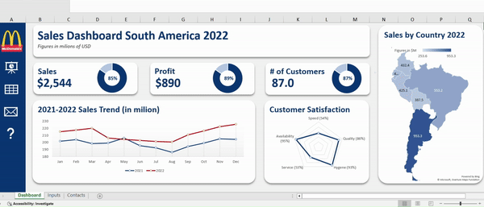

# Excel Dashboards

## CocaCola Retailer Dashboard

### 🍔 McDonald's South America Sales Dashboard Analysis:

The **McDonald's South America Sales Dashboard** provides a dynamic and interactive view of the company’s performance metrics across South America for 2022. Designed with ease of use and actionable insights in mind, this dashboard facilitates real-time exploration of data, allowing users to make strategic decisions based on key indicators and regional breakdowns.

#### 📊 Key Performance Metrics
At the top, headline figures deliver an instant overview of McDonald's success in South America:
- **Total Sales**: Generated $2,544 million in revenue, underscoring McDonald's strong market presence across the continent.
- **Profit**: Reached $890 million, with a profit-to-sales ratio of 89%, reflecting high operational efficiency.
- **Number of Customers**: Served 87 million customers, representing an 87% customer engagement rate, showcasing robust consumer interest.

These metrics provide a clear snapshot of McDonald’s financial health and customer base in the region.

#### 📈 2021-2022 Sales Trend Analysis
The "2021-2022 Sales Trend" line graph allows users to observe monthly sales trends across two years:
- **Growth Trajectory**: 2022 consistently outpaced 2021, especially from July onward, highlighting a positive growth pattern potentially due to market recovery or successful marketing efforts.
- **Seasonal Fluctuations**: Peaks in July and December suggest seasonal promotions or holidays may drive higher sales, guiding future promotional planning.

This trend analysis is essential for forecasting and identifying high-potential periods for campaigns.

#### 🌎 Regional Sales Distribution
The "Sales by Country" map visualizes revenue distribution across South American countries:
- **Top Revenue Generators**: Argentina leads with $953.3 million, followed closely by Brazil with $553.2 million, emphasizing these as McDonald's largest markets.
- **Growth Opportunities**: Countries with lower sales, such as Bolivia, present areas for targeted growth strategies or localized campaigns to expand market share.

This geographic breakdown supports region-specific strategy development and resource allocation.

#### 😊 Customer Satisfaction Analysis
The "Customer Satisfaction" radar chart offers insight into different satisfaction metrics based on customer feedback:
- **High Satisfaction in Availability (95%) and Hygiene (93%)**: Customers rate McDonald’s highly in these areas, reflecting positively on the brand's commitment to product accessibility and cleanliness.
- **Improvement Areas in Speed (54%) and Service (53%)**: Lower ratings in these categories suggest that enhancing service quality and speed could improve overall customer experience and satisfaction.

This detailed satisfaction analysis helps McDonald's prioritize areas for improvement that directly impact customer loyalty.
The **McDonald's South America Sales Dashboard** provides a dynamic and visually engaging platform for analyzing and optimizing business performance across the region. Its interactive components and real-time data insights empower decision-makers to strategize with precision and agility. 📈💼

<image src="/resources/Dashboard.png" />
